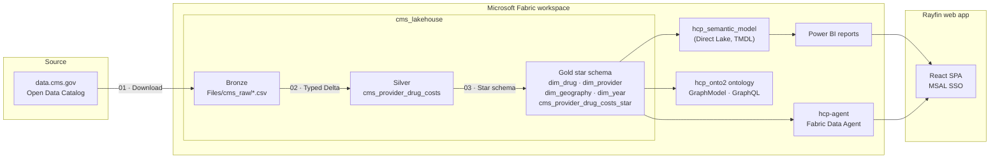

# HCP Analytics on Microsoft Fabric

End-to-end **healthcare provider (HCP) analytics** built on the public
[CMS Medicare Part D Prescribers – by Provider and Drug](https://data.cms.gov/provider-summary-by-type-of-service/medicare-part-d-prescribers/medicare-part-d-prescribers-by-provider-and-drug)
dataset.

The solution combines a Microsoft Fabric medallion lakehouse, a star-schema semantic model,
Power BI reports, a Fabric **Data Agent** (natural language → SQL) and a React single-page
app hosted with **Rayfin** that embeds both the report and the agent behind Microsoft Entra ID SSO.

Everything in this repository is deployable into your own Fabric workspace with one script.

---

## Architecture



## What is in the box

| Layer | Fabric item | Purpose |
|---|---|---|
| Storage | `cms_lakehouse` (Lakehouse) | Holds all bronze/silver/gold data |
| Bronze | `01-DownloadCMSDataCsvFiles` (Notebook) | Reads the CMS Open Data Catalog and downloads one CSV per year into `Files/cms_raw` |
| Silver | `02-CreateCMSDataTable` (Notebook) | Unions all CSVs, casts data types, derives `Year`, `Prscrbr_City_State`, `Prscrbr_Full_Name` → `cms_provider_drug_costs` |
| Gold | `03-CreateCMSStarSchemaTables` (Notebook) | Builds 4 dimensions + `cms_provider_drug_costs_star` fact table |
| Orchestration | `cms_data_pipeline` (Data pipeline) | Chains the three notebooks with success dependencies |
| Model | `hcp_semantic_model` (Semantic model, TMDL) | Direct Lake star schema over the gold tables |
| Reporting | `CMS Medicare Part D Star Schema`, `Medicare Services Report` | Power BI reports |
| AI | `hcp-agent`, `HCP-DataOneAgent` (Data agents) | Natural-language questions answered from the gold tables, with curated AI instructions and few-shot examples |
| Graph (preview) | `hcp_onto2` ontology, graph model, `GraphQL_1` | Ontology / graph access over the same data |
| App | `app/` (Rayfin) | React SPA: embedded Power BI report + agent chat |

### Gold star schema

| Table | Grain | Key columns |
|---|---|---|
| `cms_provider_dim_drug` | Brand + generic drug | `drug_key`, `Brnd_Name`, `Gnrc_Name` |
| `cms_provider_dim_provider` | Prescriber | `provider_key`, `Prscrbr_NPI`, `Prscrbr_Full_Name`, `Prscrbr_Type` |
| `cms_provider_dim_geography` | City / state | `geo_key`, `Prscrbr_City_State`, `Prscrbr_State_Abrvtn` |
| `cms_provider_dim_year` | Calendar year | `Year`, `Year_Date_Key` |
| `cms_provider_drug_costs_star` | Provider × drug × year | `Tot_Clms`, `Tot_Benes`, `Tot_Drug_Cst`, `Tot_Day_Suply`, `Tot_30day_Fills` + `GE65_*` |

---

## Quickstart

> **Heads up:** notebook 01 downloads the full CMS dataset (one CSV per year, several GB in
> total). On an F2 capacity the end-to-end pipeline typically runs for **1–3 hours**.

### 1. Prerequisites

- A Microsoft Fabric workspace on an **F2 or larger** capacity (or a Fabric trial)
- [Azure CLI](https://learn.microsoft.com/cli/azure/install-azure-cli) and **PowerShell 7+**
- **Node.js 20+** for the web app
- An Entra ID app registration for the SPA

Full details: [`docs/01-prerequisites.md`](docs/01-prerequisites.md)

### 2. Deploy the Fabric items

```powershell
az login
git clone https://github.com/claudiomirti/HCP.git
cd HCP

./scripts/deploy-fabric.ps1 -WorkspaceId <your-workspace-guid>
# add -IncludePreview to also deploy the ontology, graph model and GraphQL API
```

The script creates the lakehouse, waits for its SQL analytics endpoint, then creates the
notebooks, pipeline, semantic model, reports and data agents — rewriting every embedded ID
to match your workspace. It prints the report and agent IDs you need in step 4.

Details: [`docs/02-deploy-fabric.md`](docs/02-deploy-fabric.md)

### 3. Load the data

```powershell
./scripts/run-pipeline.ps1 -WorkspaceId <your-workspace-guid>
```

When it finishes, `cms_lakehouse` contains the silver table and all five gold tables.

### 4. Run the web app

```powershell
cd app
Copy-Item .env.example .env.local     # fill in the values printed by deploy-fabric.ps1
npm install
npm run dev                            # http://localhost:5173
```

Deploy it to Fabric with Rayfin:

```powershell
npx rayfin up
```

Then add the resulting `https://<name>.webapp.fabricapps.net` URL to
`app/rayfin/rayfin.yml → services.auth.allowedRedirectUris` **and** to the redirect URIs of
your Entra app registration.

Details: [`docs/03-deploy-app.md`](docs/03-deploy-app.md)

### 5. Publish the data agent

Open `hcp-agent` in the Fabric portal, verify it is pointed at `cms_lakehouse`, and press
**Publish**. The AI instructions and few-shot examples are already part of the deployed
definition. See [`docs/04-data-agent.md`](docs/04-data-agent.md).

---

## Repository layout

```
HCP/
├── app/                 React SPA (Rayfin) - report embed + data agent chat
│   ├── src/             App, config, PowerBIReport, DataAgentChat components
│   ├── rayfin/          rayfin.yml service manifest
│   └── .env.example     Template for your tenant-specific IDs
├── fabric/              Exported Fabric item definitions (tokenised)
│   ├── Lakehouse/  Notebook/  DataPipeline/
│   ├── SemanticModel/  Report/  DataAgent/
│   └── Ontology/  GraphModel/  GraphQLApi/  SQLDatabase/
├── scripts/
│   ├── deploy-fabric.ps1   Create/update all items in a target workspace
│   ├── run-pipeline.ps1    Trigger cms_data_pipeline and wait
│   └── export-fabric.ps1   Re-export definitions from a workspace
└── docs/                Step-by-step deployment guides
```

### About the `<<TOKEN>>` placeholders

The files under `fabric/` are real Fabric definitions with workspace-specific identifiers
replaced by placeholders such as `<<WORKSPACE_ID>>`, `<<CMS_LAKEHOUSE_ID>>` and
`<<SEMANTIC_MODEL_ID>>`. `deploy-fabric.ps1` substitutes them at deploy time, which is why
the definitions are portable across tenants and contain no tenant data.

---

## Data & licensing

The CMS Medicare Part D Prescribers dataset is published by the U.S. Centers for Medicare &
Medicaid Services as public domain open data. It contains **no patient-level information** —
records are aggregated per prescriber, drug and year, with low counts suppressed by CMS.
Review the [CMS data disclaimers](https://data.cms.gov/provider-summary-by-type-of-service/medicare-part-d-prescribers)
before publishing any analysis.

Code in this repository is released under the [MIT License](LICENSE).

## Contributing

Issues and pull requests are welcome. If you change something in the Fabric portal, run
`./scripts/export-fabric.ps1` and re-apply the tokens before committing.
